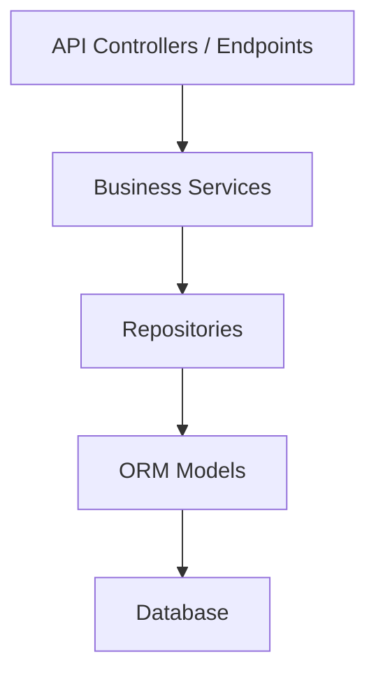

# SpeakLift Backend: Architecture Freeze v1.0

## Vision

The purpose of SpeakLift is to provide an AI-Powered Interview & Viva Confidence Platform. The core architectural philosophy of the backend is predictability, immutability, and robustness. The system operates as a **Modular Monolith** designed around Domain-Driven Design (DDD) principles to safely orchestrate complex NLP pipelines and adaptive interview workflows.

---

## Architecture Style

The SpeakLift backend architecture strictly conforms to the following paradigms:
- **Modular Monolith**: Code is logically partitioned by domain (matching, evaluation, reporting, execution) while deploying as a single artifact.
- **Layered Architecture**: Clear horizontal separation of concerns preventing UI/API logic from bleeding into the database.
- **Repository Pattern**: All database interactions are abstracted via interface-like protocols.
- **Dependency Injection**: Centralized bootstrapping of domain services ensuring lifecycle isolation and maximum testability.
- **SOLID**: High cohesion and single responsibility are strictly enforced.
- **DDD-inspired Aggregates**: Data bounds (e.g. `InterviewSession` + `InterviewQuestion`) govern transaction consistency.
- **Immutable Business Schemas**: Application state is primarily passed using deeply immutable Pydantic models.
- **ADR-driven Evolution**: All architectural changes trace back to a documented Architecture Decision Record.

---

## Layer Diagram

Dependencies **MAY ONLY FLOW DOWNWARD**. Reverse dependencies are strictly prohibited.

- **API Controllers** depend on Business Services.
- **Business Services** depend on Repositories and generic infrastructure/AI adapters.
- **Repositories** depend on ORM Models.
- **ORM Models** are oblivious to the application above them.

---

## Business Rules

1. **Business schemas are immutable.** State is not mutated in-place; methods return new instances representing the updated state.
2. **ORM models never leave repositories.** All repository responses must either be mapped to a Domain Pydantic schema OR the caller strictly reads properties and dumps them into Domain schemas. Passing ORM objects straight into HTTP responses is forbidden.
3. **Repositories never contain business logic.** Repositories only contain CRUD and ORM-specific query building logic (e.g., joins, `.in_()` filters). They do not evaluate conditions or apply domain metrics.
4. **Services own orchestration.** The Business Service layer handles all algorithms, multi-repository coordination, and workflow state transitions.
5. **Endpoints remain thin.** Fast API endpoints are only responsible for request validation, dependency injection consumption, and HTTP response formatting.

---

## AI Rules

1. **Evaluation happens once.** When an answer is submitted, the NLP extraction and AI qualitative evaluations are performed exactly once.
2. **Persist AnswerEvaluation.** The result of the one-time evaluation is permanently saved into the `AnswerEvaluation` table.
3. **Report engine reads persisted data.** The Interview Intelligence Engine (M3.2) generates reports strictly by reading `AnswerEvaluation`.
4. **Never re-evaluate.** Downstream pipelines must never recalculate deterministic metrics (grammar, concept coverage) or re-run confidence extractors on historical answers.
5. **LLM is reviewer—not evaluator.** For reporting, the LLM receives aggregated facts (statistics, strengths) rather than raw transcripts, acting as a "Senior Reviewer" rather than performing granular textual evaluation.

---

## Adaptive Interview Rules

1. **`execution_path`**: The queue is represented via a lexicographically sortable materialized path (`01`, `01.01`, `02`).
2. **`planned_order`**: Represents the initial, immutable map sequence of the interview (1, 2, 3).
3. **Follow-up Insertion**: Follow-ups branch dynamically by appending sub-paths (e.g., `01` -> `01.01`).
4. **Queue Replay**: Sorting the database query by `execution_path` guarantees deterministic playback of the exact conversational flow.
5. **Never change execution ordering strategy.** The queue system is mathematically closed and must remain so.

---

## Persistence Rules

- `AnswerEvaluation` becomes the **single source of truth** for all answer intelligence.
- If data does not exist in `AnswerEvaluation`, it cannot magically appear in the final Interview Report.

---

## Report Rules

The Report Engine (`InterviewReportService`):
- **MUST NEVER** perform NLP feature extraction.
- **MUST NEVER** evaluate candidate text directly.
- **MUST ONLY** compose and aggregate persisted evidence.

---

## Dependency Rules

### Allowed Dependencies
- `app.api` MAY import `app.services` and `app.dependencies`.
- `app.services` MAY import `app.repositories` and `app.shared`.
- `app.repositories` MAY import `app.models` and `app.db`.

### Forbidden Dependencies
- `app.repositories` MUST NEVER import `app.services`.
- `app.models` MUST NEVER import `app.repositories` or `app.services`.
- Cross-domain circular imports (e.g., `app.services.evaluation` importing `app.services.interview_execution` while `interview_execution` imports `evaluation`) are strictly forbidden. Dependency inversion (via protocols) must resolve any routing needs.

---

## Future Changes

Any future modification to these frozen architectural guidelines requires:
1. Submission of a formal **ADR (Architecture Decision Record)**.
2. A formal **Architecture Review** by principal engineers.
3. Explicit **Approval** before implementation commences.
