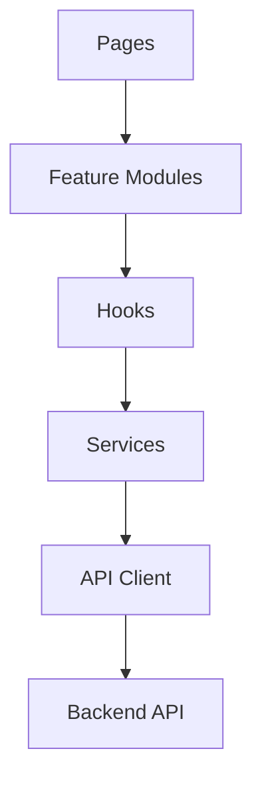

# SpeakLift: Frontend Architecture

## Architectural Philosophy
The SpeakLift frontend is designed as a scalable, high-performance web application utilizing modern React paradigms. We employ a **Layered Feature-Driven Architecture** to ensure that as the application scales from a simple interview practice tool to a complex career development platform, the codebase remains modular, predictable, and maintainable.

## Technology Stack
- **Core**: Next.js (App Router), React, TypeScript
- **Styling**: Tailwind CSS, shadcn/ui
- **State Management**: TanStack Query (Server State), Zustand (Client/Global State)
- **Forms**: React Hook Form, Zod
- **Animation**: Framer Motion
- **Data Visualization**: Recharts
- **Notifications**: Sonner
- **Theming**: next-themes
- **Networking**: Axios

## Frontend Layered Architecture

Dependencies must only flow downward.

### 1. Pages (Next.js App Router)
- **Responsibility**: Define the routing hierarchy, layout boundaries, and suspense boundaries.
- **Constraints**: Pages should contain almost zero business logic. They act purely as composition roots, assembling top-level Feature Modules.

### 2. Feature Modules
- **Responsibility**: Encapsulate a complete vertical slice of functionality (e.g., `InterviewSession`, `CandidateProfile`).
- **Constraints**: Feature modules may compose multiple generic UI components but must own the domain-specific layout and interaction logic for that slice.

### 3. Hooks (Custom Hooks)
- **Responsibility**: Orchestrate state and side-effects. This is where TanStack Query hooks (e.g., `useInterviewReport`) and Zustand selectors reside.
- **Constraints**: Hooks must not contain JSX. They must return purely data, loading states, and callback functions.

### 4. Services (API Wrappers)
- **Responsibility**: Provide strongly-typed, domain-specific wrappers around the generic API Client (e.g., `InterviewService.getReport(id)`).
- **Constraints**: Services must not hold React state. They are pure async functions returning Promises.

### 5. API Client (Axios)
- **Responsibility**: Handle the raw HTTP protocol, base URLs, interceptors (for auth tokens), timeout enforcement, and standardized error normalization.
- **Constraints**: Knows nothing about domain business logic.

## Forbidden Dependencies
- **Upward Dependencies**: A Hook must never import a Page. A Service must never import a Hook.
- **Cross-Feature Coupling**: Feature A (e.g., `Billing`) should not deeply import from Feature B (e.g., `Interviews`). If shared logic is needed, it must be promoted to the `shared/` core module.
- **API Leakage**: UI components must never directly import Axios or make raw `fetch` calls. All network access must be brokered through a custom hook calling a Service.

## Future Readiness
This architecture inherently supports:
- **Streaming AI**: By abstracting the API layer, streaming adapters (e.g., Server-Sent Events) can be introduced at the Service layer without rewriting the UI components.
- **Mobile Application**: The strict separation of Hooks/Services from UI allows the business logic to be easily ported to React Native in the future.
- **Voice Interviews**: The component system isolates audio-recording APIs into dedicated generic hooks, ensuring the rest of the application remains unaware of the hardware APIs.
